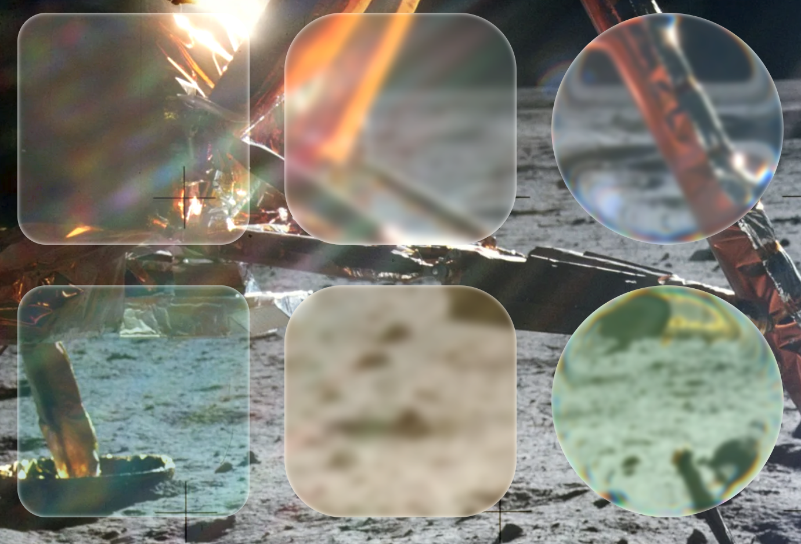

# WebGlass
WebGlass is a simple yet powerful tool allowing the creation of glass-like objects in HTML.



[Demo Webpage]

## Features
WebGlass has a large feature set allowing you to customize your glass how you like it.

|Feature |Value  | Description|
|--------|--------|-------|
|depth|Number|Changes the size of the refraction on the glass.|
|blur|Number|Changes how frosted the glass is.|
|chromaticAberration|Number|Changes the strength of the color fringing.|
|debug|Boolean, False by default|Enables debug map of the refraction.|
|color|#hexcode|Changes the tint of the stained glass.|
|transparency|Number 0-1|Changes the opacity of the glass.|
|isLiquid|Boolean, True by default|Enables refraction in the glass.|

## Presets
Here’s some configurations we recommend:

Glass:
```
{ blur: 0, transparency: 0.2, isLiquid: false }
```

Frosted Glass:
```
{ blur: 4, transparency: 0.1, isLiquid: false }
```

Liquid Glass (Chromium ONLY*):
```
{ depth: 7.5, blur: 2, chromaticAberration: 10, transparency: 0.1, isLiquid: true }
```

Stained Glass:
```
{ blur: 0, transparency: 0.3, color:"#009999", isLiquid: false }
```

Stained Frosted Glass:
```
{ blur: 4, transparency: 0.2, color:"#009999", isLiquid: false }
```

Stained Liquid Glass (Chromium ONLY*):
```
{ depth: 7.5, blur: 2, chromaticAberration: 10, transparency: 0.2, color:"#009999", isLiquid: true }
```

All presets can be used by adding the preset key:
```
{ preset: "Liquid Glass"}
```

For Stained Variants a color must be provided with the preset, for example:
```
{ preset: "Stained Liquid Glass", color:"#009999"}
```

Using a preset will NOT override your configuration!

*Chromium Only elements will fall back to normal or frosted glass on WebKit and Gecko.

## Usage
Install WebGlass:
```
<script src="https://cdn.jemcats.software/WebGlass/latest/WebGlass.min.js"></script>
```

Make new pane of glass using ```CreateGlass```:
```
document.body.appendChild(WebGlass.CreateGlass({ height:"100px", width:"100px", radius: "10px", Your: "Options"}))
```

Make existing element into a pane of glass with ```Glassify```:
```
WebGlass.Glassify(document.getElementById('div'), { Your:"Options" })
```

## Contributing
Fork the ```dev``` branch.

Make changes.

Open pull request.

## License
This project is licensed under the GPL-3.0 license.

You may:
- Modify and redistribute the code,
- Only if you keep it open-source and GPL-licensed,
- Provide credit to the original author (JEMcats-Software).

No closed-source forks or redistributions allowed.

## Support
For questions open a discussion.

For support, reports, or requests open an issue.

## Credits
- [Medium](https://medium.com/ekino-france/liquid-glass-in-css-and-svg-839985fcb88d)